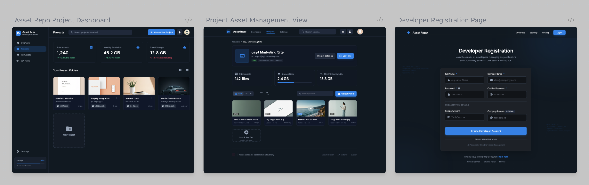

# Asset Repo

Asset Repo is a developer-focused asset management console for organizing projects and assets, with a clean, modern UI, project thumbnails, and detailed asset views. It integrates with a backend API for authentication, projects, and asset handling.

## Developer

This project is developed by Jegede Oluwafemi Joshua.

## UI Design



## Features

- Authentication (login/signup) with token stored in a 7‑day cookie
- Projects dashboard with grid/list view, search, and pagination
- Project detail view with asset upload, preview, and actions
- All Assets page with search, pagination, and deep detail view
- Mobile-ready sidebar with open/close drawer

## Pages

- `/` — Marketing/landing page
- `/auth/login` — Developer login
- `/auth/signup` — Developer registration
- `/dashboard` — Projects overview
- `/projects/[id]` — Project detail + assets
- `/projects/[id]/edit` — Project edit + member management
- `/assets` — All assets (user + member project assets)
- `/assets/[id]` — Asset detail page

## Setup

1) Install dependencies:

```bash
npm install
```

2) Create a `.env.local` file in the project root:

```bash
NEXT_PUBLIC_API_BASE_URL=http://localhost:8000
NEXT_PUBLIC_COMPANY_NAME=Asset Repo
NEXT_PUBLIC_COMPANY_DOMAIN=assetrepo.com
```

3) Run the development server:

```bash
npm run dev
```

Open [http://localhost:3000](http://localhost:3000) with your browser to see the result.

## Notes

- The app expects the API to run at `NEXT_PUBLIC_API_BASE_URL`.
- The sidebar navigation links to `/dashboard` and `/assets`.
- Asset and project data are fetched via the API (no dummy data).

This project uses [`next/font`](https://nextjs.org/docs/app/building-your-application/optimizing/fonts) to automatically optimize and load [Geist](https://vercel.com/font), a new font family for Vercel.

## Learn More

To learn more about Next.js, take a look at the following resources:

- [Next.js Documentation](https://nextjs.org/docs) - learn about Next.js features and API.
- [Learn Next.js](https://nextjs.org/learn) - an interactive Next.js tutorial.

You can check out [the Next.js GitHub repository](https://github.com/vercel/next.js) - your feedback and contributions are welcome!

## Deploy on Vercel

The easiest way to deploy your Next.js app is to use the [Vercel Platform](https://vercel.com/new?utm_medium=default-template&filter=next.js&utm_source=create-next-app&utm_campaign=create-next-app-readme) from the creators of Next.js.

Check out our [Next.js deployment documentation](https://nextjs.org/docs/app/building-your-application/deploying) for more details.
